# My Bank

This is my simple banking example to introduce you to my acquired skills and abilities. This project 
is based on Rest Api and Spring framework using JWT token for authentication, and it is about a bank where 
user can create his account where he can have multiple cards, with accounts and manage them.
For example: delete, add cards, receive and send funds, see transaction history, see your balance and so on.

## Table of Contents

- [Installation](#installation)
- [Usage](#usage)
- [About "Users"](#users)
- [About "Cards and Accounts"](#cards-and-accounts)
- [About "Transactions"](#transactions)
- [About "Authorization"](#authorization)
- [About "Security Config"](#security-config)
- [Users data DB](#users-data)
- [Example of Using](#example)
- [Tests](#tests)
- [Conclusion](#conclusion)

----------------------------------------------------------------------------------------------------------------------

## Installation

In my project, as you see, I have already committed pom.xml and app.properties files, 
so you only need to clone my repository to your PC and create in your mySql db table with name: 
"myBank" and create Configuration which will starts with [MyBankStarter class](src%2Fmain%2Fjava%2Fcom%2Fpet%2Fproject%2FMyBankStarter.java)
and added to field "Environment variables" something like that:

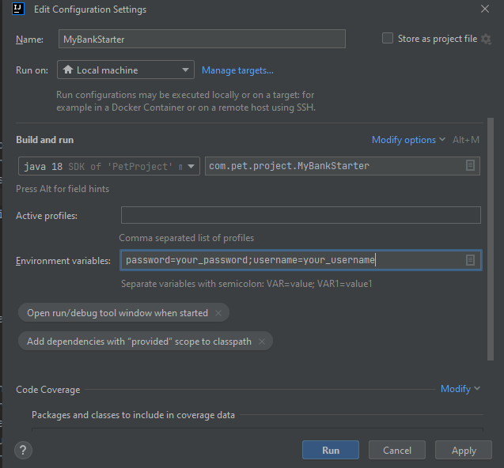

`password=your_password;username=your_username` where you need to write instead of your_password, password that you indicated in db settings
(likewise with username).
After that, you need to run the project to initialize the password and username in the application.properties file, and then run it a second time
after which the project will work correctly!

$ git clone https://github.com/MasakDirt/petProjectBank.git

----------------------------------------------------------------------------------------------------------------------

## Usage

About using, you already had three user which created in db table when you start running app:

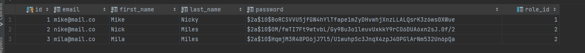

Well, and all they need created too, example:
we have customer "Mike" who has role "ADMIN", so he has more opportunities, but not about it now.
So, you can authorize with Mike`s email and password, than you are provided with jwt token and go to all URLs(for which you are authorized) with that token.
Then you can check his: user-account, update account user or users(depends on userRole),
delete your account or if you ADMIN not only yours account, check your cards, create new card, replenish the balance, delete card,
create transactions = send someone else your money, for example: your mom need 150$,  you create a transaction in URL:
"/api/customers/{owner-id}/cards/{card-id}/transactions" with post mapping where must write your mom card and sum which
you want to transfer.

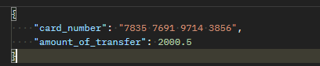

**About URLs: if you want to get one entity or update, delete entity
you must add at the end of all URLs `/{id}` the object with which you want to do something!**

In this example I need to get customer with id 4, if any!

Next, let's analyze the main entities separately.

----------------------------------------------------------------------------------------------------------------------

## "Users":
Users has his Roles table. Roles table need to distribute responsibilities before users and adding authorities.
In role table we have only two Roles: "USER" and "ADMIN", but this does not exclude the fact that new ones may be added.
So, Admin can do almost all, but User only with what is his, or cannot interact at all, it depends on methods.
Customers as a human have fields: first_name, last_name, email, password, role and list of hisCards.
[Here you can check his methods and fields](src%2Fmain%2Fjava%2Fcom%2Fpet%2Fproject%2Fmodel%2Fentity%2FCustomer.java)

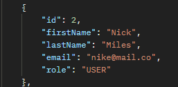

And that: [his Service class](src%2Fmain%2Fjava%2Fcom%2Fpet%2Fproject%2Fservice%2Fimpl%2FCustomerServiceImpl.java) where you can find 
[CardRepository class](src%2Fmain%2Fjava%2Fcom%2Fpet%2Fproject%2Frepository%2FCardRepository.java) for interactions with DB,
[his Controller class](src%2Fmain%2Fjava%2Fcom%2Fpet%2Fproject%2Fcontroller%2FCustomerController.java) where you can 
find all REST methods for Customer (to control or check users rest methods, use `/api/customers` URL),
[customers DTO and mapper](src%2Fmain%2Fjava%2Fcom%2Fpet%2Fproject%2Fmodel%2Fdto%2Fcustomer) it`s for better interactions with REST usages.
The "Cards" field is also available to the user, so read on for more information about them:...

----------------------------------------------------------------------------------------------------------------------

## "Cards and Accounts":
On my opinion, "Cards" it is a middle strings between customer and bank administrators. 
So I decided to create a cards with random numbers, but only first four was constant (7835).
Card has an objects of his Owner and Account. [Card entity.](src%2Fmain%2Fjava%2Fcom%2Fpet%2Fproject%2Fmodel%2Fentity%2FCard.java)
In REST [CardController](src%2Fmain%2Fjava%2Fcom%2Fpet%2Fproject%2Fcontroller%2FCardController.java)
(to control or check cards rest methods, use `/api/customers/{owner-id}/cards` URL) I have methods for creating it, 
checking it, updating it, that is replenished the balance in account and of course deleting it is all has an PreAuthorize annotation to
preventing you from doing something bad with the card. Here you can check [CardRepository,](src%2Fmain%2Fjava%2Fcom%2Fpet%2Fproject%2Frepository%2FCardRepository.java)
and [CardServiceImpl.java](src%2Fmain%2Fjava%2Fcom%2Fpet%2Fproject%2Fservice%2Fimpl%2FCardServiceImpl.java) for understanding constructions of my project.
[Cards DTO and mapper](src%2Fmain%2Fjava%2Fcom%2Fpet%2Fproject%2Fmodel%2Fdto%2Fcard), example of CardResponse dto:

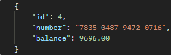

I think account is the main in card. We go to the [account entity,](src%2Fmain%2Fjava%2Fcom%2Fpet%2Fproject%2Fmodel%2Fentity%2FAccount.java) now.
In account, I have: balance, card(between card and account I have created one-to-one relationship), list of transactions (which I will write about a little later).
In my [CardController](src%2Fmain%2Fjava%2Fcom%2Fpet%2Fproject%2Fcontroller%2FCardController.java) if you can see, are even more closely connected account and card
almost all transformations on the card are made through [AccountServiceImpl](src%2Fmain%2Fjava%2Fcom%2Fpet%2Fproject%2Fservice%2Fimpl%2FAccountServiceImpl.java)
from which we call up methods of [CardServiceImpl](src%2Fmain%2Fjava%2Fcom%2Fpet%2Fproject%2Fservice%2Fimpl%2FCardServiceImpl.java) class,
I consider it necessary, because it is no longer right to separate them too much, and they are like twin brothers who will not last long without each other.
Since account and card are connect, so they have identical methods in REST controller.

Lat`s talk about transactions...

----------------------------------------------------------------------------------------------------------------------

## "Transactions":

Transactions it`s the most interesting and unpredictable entity for whole project. I liked that! 
So in [Transaction entity](src%2Fmain%2Fjava%2Fcom%2Fpet%2Fproject%2Fmodel%2Fentity%2FTransaction.java) you can see much more fields than in previous entities.
Transaction fields: createdAt - it is time when transaction was happened, transferAmount - it is sum which user wants to transfer to another user using the card
for it, I created field - recipientCard, than we have balanceAfter- balance which was left after transaction and fundsWithdrawn - 
funds which money that was spent from the card(account).
I like my transactions classes, and hope that you will like it ,too. 

Here you can see [Transactions DTO and mapper](src%2Fmain%2Fjava%2Fcom%2Fpet%2Fproject%2Fmodel%2Fdto%2Ftransaction),

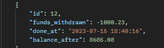 

last created using mapstruct library.
[Transaction Controller](src%2Fmain%2Fjava%2Fcom%2Fpet%2Fproject%2Fcontroller%2FTransactionController.java) class with my REST methods
(to control or check transactions rest methods, use `/api/customers/{owner-id}/cards/{card-id}/transactions` URL) for transactions and here you can see using
[TransactionServiceImpl class](src%2Fmain%2Fjava%2Fcom%2Fpet%2Fproject%2Fservice%2Fimpl%2FTransactionServiceImpl.java) in which using [TransactionRepository](src%2Fmain%2Fjava%2Fcom%2Fpet%2Fproject%2Frepository%2FTransactionRepository.java), 
so you can check it.
In REST [Transaction class](src%2Fmain%2Fjava%2Fcom%2Fpet%2Fproject%2Fcontroller%2FTransactionController.java) I using get mapping for gets all transactions, 
something like history and for get one transaction, you can create it, too, I talked about this in the example at the 
beginning, and you can delete it, but it can do only Admin.

----------------------------------------------------------------------------------------------------------------------

## "Authorization":

As I said, I am using JWT token in my SecurityContext for Authorization, [here my auth-controller](src%2Fmain%2Fjava%2Fcom%2Fpet%2Fproject%2Fcontroller%2FAuthController.java)
class (to control or check authentication rest methods, use `/api/auth/login` or `/api/auth/register` URLs) where I used [JwtUtils for generating token](src%2Fmain%2Fjava%2Fcom%2Fpet%2Fproject%2Futils%2FJwtUtils.java), 
[from AppConfig passwordEncoder](src%2Fmain%2Fjava%2Fcom%2Fpet%2Fproject%2Fconfig%2FAppConfig.java) to encode all customers passwords
and Services, mapper to creating a customer.

So I also used [AuthTokenFilter](src%2Fmain%2Fjava%2Fcom%2Fpet%2Fproject%2Ffilter%2FAuthTokenFilter.java) for filtering tokens, 
[GlobalExceptionHandler class](src%2Fmain%2Fjava%2Fcom%2Fpet%2Fproject%2Fexception%2FGlobalExceptionHandler.java) which catch all exceptions and
gives user understanding information for him.

## "Security Config":
In [Security Config](src%2Fmain%2Fjava%2Fcom%2Fpet%2Fproject%2Fconfig%2FSecurityConfig.java) I had 
[AuthEntryPointJwt](src%2Fmain%2Fjava%2Fcom%2Fpet%2Fproject%2Fcomponent%2FAuthEntryPointJwt.java) for sending errors
if something goes wrong during authorization,
and I had three URLs which allows without authorization:
it is home page, login and register.

----------------------------------------------------------------------------------------------------------------------

## "Users data":
| Username     | Password | Role  |
|--------------|----------|-------|
| mike@mail.co | 1111     | ADMIN |
| nike@mail.co | 2222     | USER  |
| mila@mail.co | 3333     | USER  |

----------------------------------------------------------------------------------------------------------------------

## "Example":
Firstly, when we open any website we need to register, or login, lets do both.

#### **About Access**:
Customers with admin rights can do everything and for all users that exist,
except for creating transactions,
only the card owner can create it!

Customers with user rights, on the other hand, are much more limited, they can only read and update their account;

With cards: create, get all, one, delete, top up the balance, but only their own, while the admin can do all of them;

Then transactions: the user can only create and view them, that's it!

#### **REGISTER**:

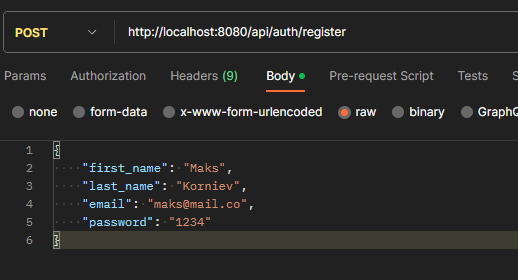

Here you can see `http://localhost:8080/api/auth/register` URL where we create new Customer with _first name_ - Maks, _last name_ - 
Korniev, _email_ - maks@mail.co and _password_ - 1234.
In this stage our customerRepository created new customer in db, and return to us that response dto:

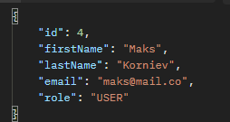

In this example we can see that our customer was created with **role** `User`, 
it is true, when we create an account ourselves, we automatically receive role - `User`, but if customer with role
**ADMIN** create user-account by URL:
`http://localhost:8080/api/customers` by post-method it will be customer with `Admin` role.

#### **LOGIN**:

Since we have registered a user with **email** - `maks@mail.co` and **password** - `1234`, 
let`s login with it params.(but you can logIn with user-params from db [check it](#users-data)!)

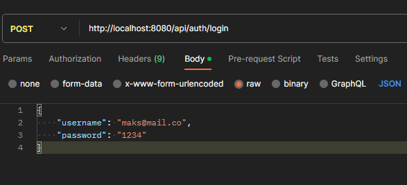

We sent this request to login and get:

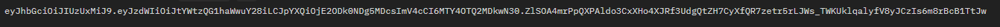

our **token** with which we must authorize anywhere!

#### **Check Our Account**:
Since we are not administrator, we cannot see the list of all users, but we can look at ourselves!

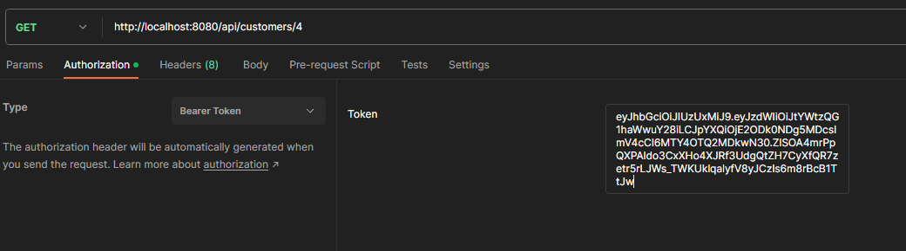

Used a token that we get to authorize and check our account.(In all next methods I will use token to authorize, too,
but I won't show it to avoid repeating myself!)

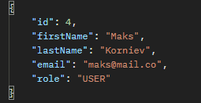

We get this response again!

#### **Update Our Account**:
So then we can update our customer, for example: I don`t like my name, and I want to change it.

P.S. We can not change email, because we log into the system through it!

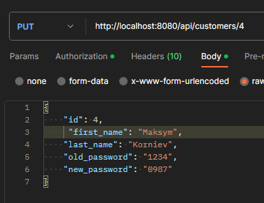

As you can see, we used put-mapping and I will not to change my name to `Maksym`, look at id`s, 
if the id in the request does not match the id in the URL, then access will be denied, that is,
it will inform that the users do not match!

Response that we get:

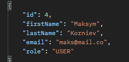

As you can see, our name has changed, and I would also like to point out that
if the old password did not match the password in the db,
we would have gotten an error about incorrect passwords!

I have shown everything that we can do with our account as a user,
a little further down I will show you what else the admin can do, and now there will be a card.

#### **Create Card**:

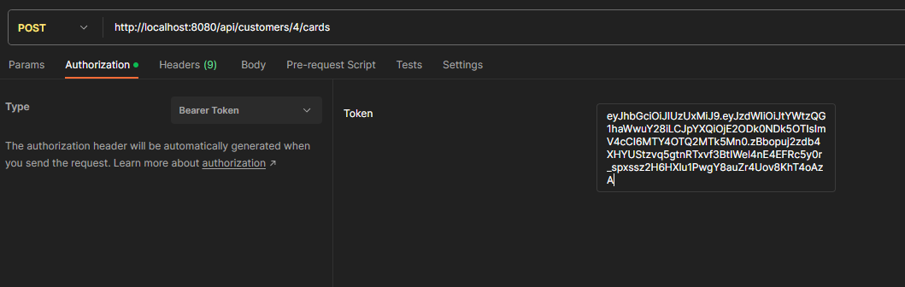

To create a card, we just need to press an imaginary "button" and everything will appear:

And a few more for example:

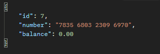

#### **Check my Cards**:
To receive cards, you just need to press the button:

and we get all cards that we create:

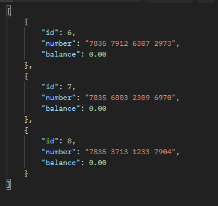

Now let's top up our card balance.

#### **Replenish Balance**:
We need to specify the amount by which we want to replenish the balance and the card ID in the URL:

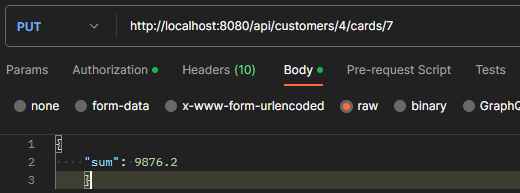

Then we get:

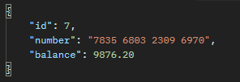

And we see that the balance has been replenished.
Then I replenish all the cards in this way, and check now our updated cards:

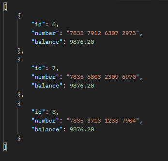

#### **Delete Card**:
Now let's check the card deletion, we will delete card with id 8:

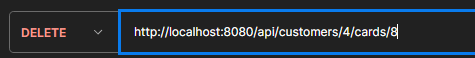

And we need to get simple message about deleting!

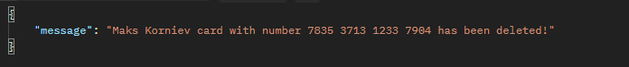
Let`s check all cards, here must be 2 cards:

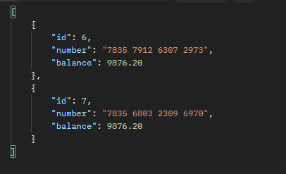

Yep, card with id 8 was deleted!
Also, having cards and money on them, we can transfer funds to other users,let's see how it works;

#### **Create Transaction**:
To create a transaction,
we need to know the number of the card to which we want to send and
have enough money on the balance to transfer!

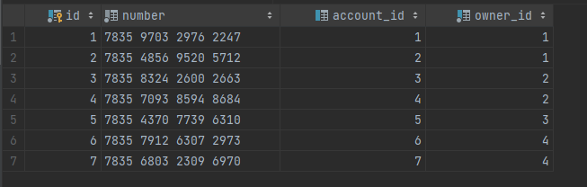

Here we can see table with cards numbers, and I want to transfer to card with id 3:

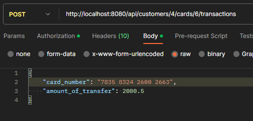 -this is how we should transfer funds.

And what we get:

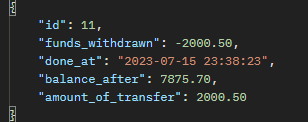 

As we can see, the transaction was successful and the funds were sent to another user.

Now I will make two more such transactions and see it history.
#### **History Transactions**:
To get the history, we also press the "button":

And we get, 3 our transactions:

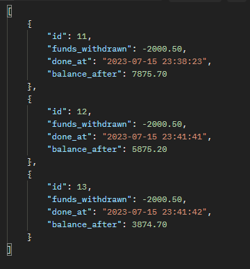

This is almost all we can do as a user, we can also receive a card and a transaction,
but it's not that interesting,
so I skipped them.

### **ADMIN Methods**:
###### **_Restarted the program_**
#### **Create Admin Customer**:
To create an admin, we need to log in as an admin:

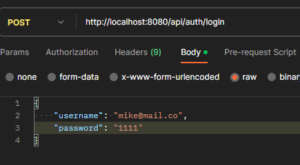

After that, you need to create:

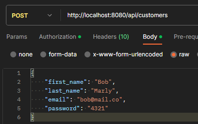

And we get:

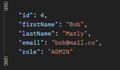

It is like with `User` role.

#### **Get All Customers**:
But getting all existing users is more interesting!!!

"Button":

And get all:

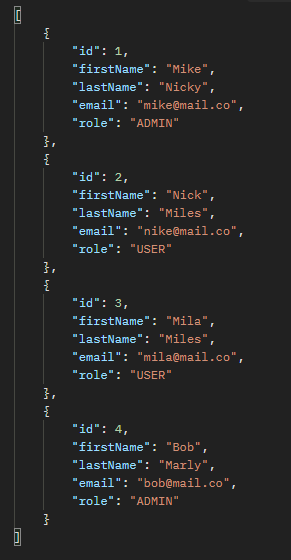

As you can see, we have a newly created admin and existing users in the database.
Also, the admin can delete users, but it's quite boring and the same as with the card.
And of course, he can watch everything and everyone.
And of course, he can watch everything and everyone,
and you can also create things, except for transactions, remember!!!

#### **Conclusion in Example**:
Then it turns out that I showed you everything, but I didn't show you how to delete users and transactions,
because it's like with a card, and getting one transaction or card is the same as getting many,
only there they are one by one! So thank you all for reading, you can check it out in your Postman if you want.

----------------------------------------------------------------------------------------------------------------------

## "Tests":
In this project used SpringBoot and MockMvc tests:
[RoleTests](src%2Ftest%2Fjava%2Fcom%2Fpet%2Fproject%2Fmodel%2FRoleTests.java), [TransactionControllerTests](src%2Ftest%2Fjava%2Fcom%2Fpet%2Fproject%2Fcontroller%2FTransactionControllerTests.java).
All hibernate entities, services, controllers, repositories methods have been tested and passed all the checks, you can see for yourself:
[All Tests](src%2Ftest%2Fjava%2Fcom%2Fpet%2Fproject).

-------------------------------------------------------------------------------

## "Conclusion":

I really enjoyed developing my project, and I want to try myself on a real project as soon as possible.
Thank you for paying attention to my project.

I hope this was clear to you, and if not, you can contact me for further details:

Telegram: `@mskdrttt`

E-mail: `maksimkarulet8@gmail.com`.

----------------------------------------------------------------------------------------------------------------------